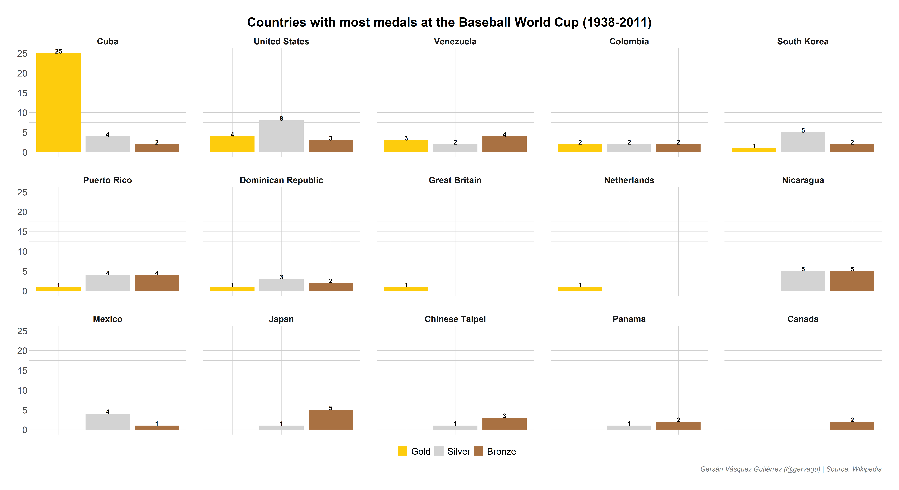

# Web Scraping from Wikipedia: Baseball Worldcup Winners 

Web scraping in R using `rvest` and plotting the data with `Tidyverse`.

# Data

The data comes from [the Baseball World Cup’s Wikipedia page](https://en.wikipedia.org/wiki/Baseball_World_Cup)
